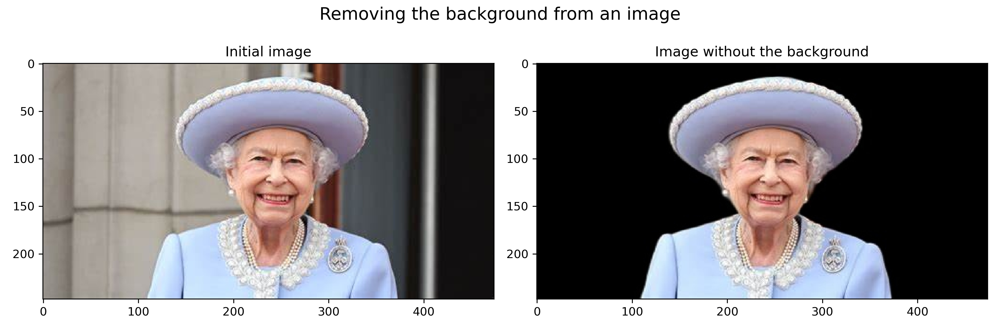
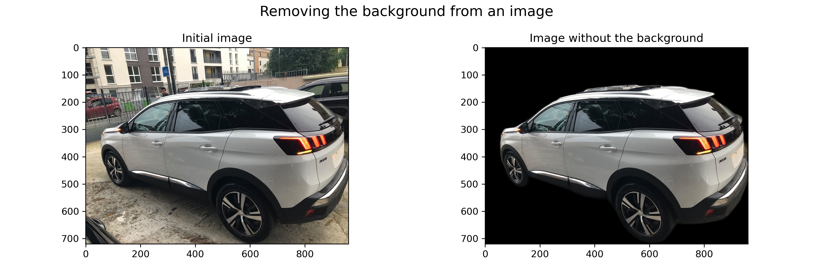
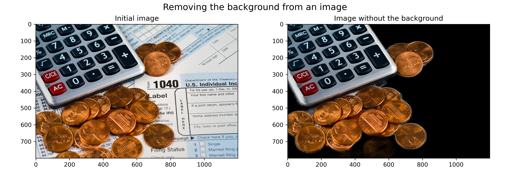
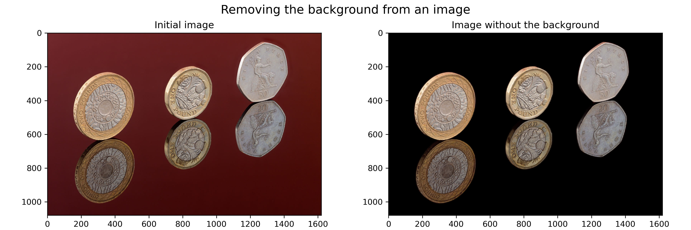
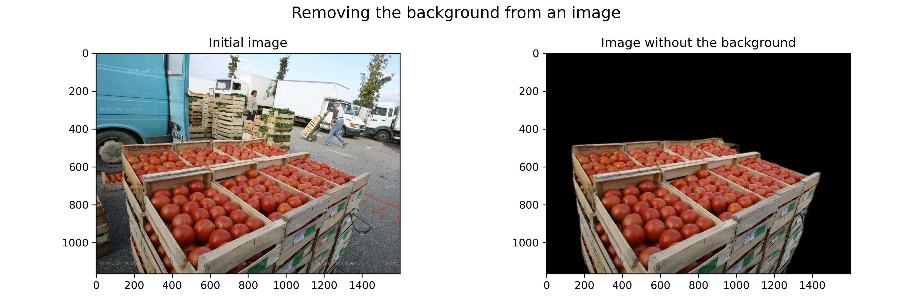
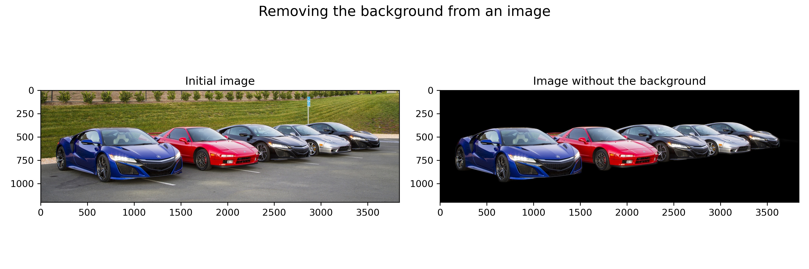

# Removing background from an image

Rembg is a python tool to remove images background.
pretty useful for some computer vision usecase where you need to focus on some parts of the image.

 
03-June-2022

Serge Retkowsky | serge.retkowsky@microsoft.com | https://www.linkedin.com/in/serger/
